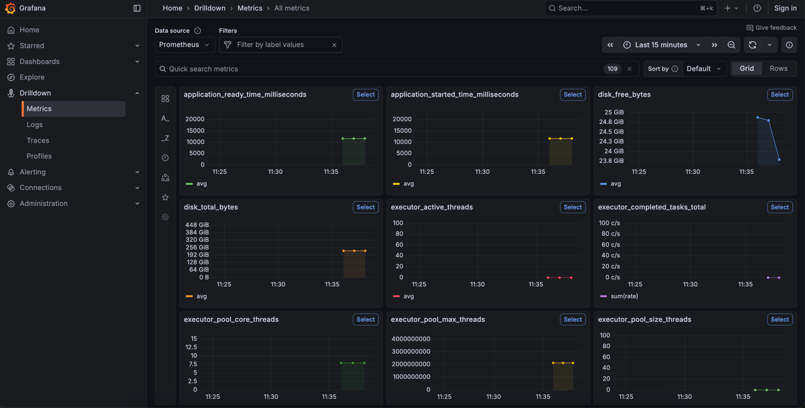
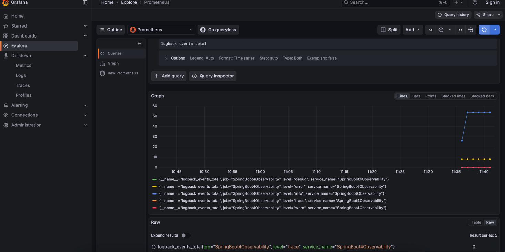
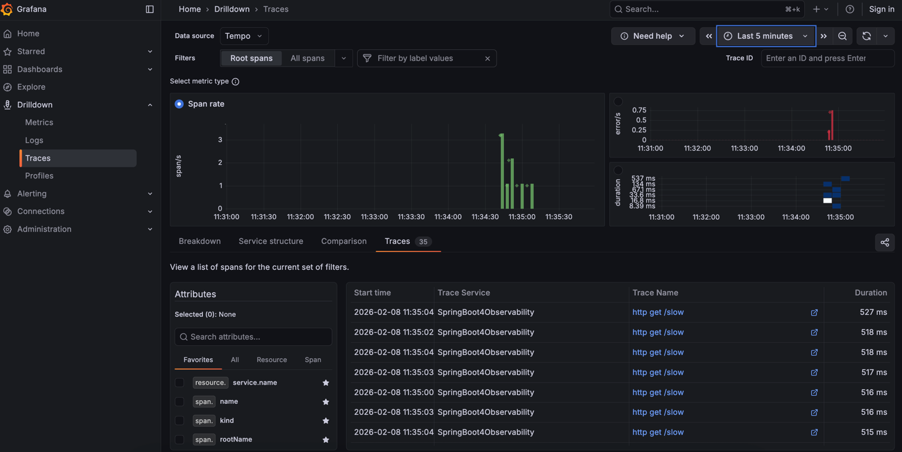
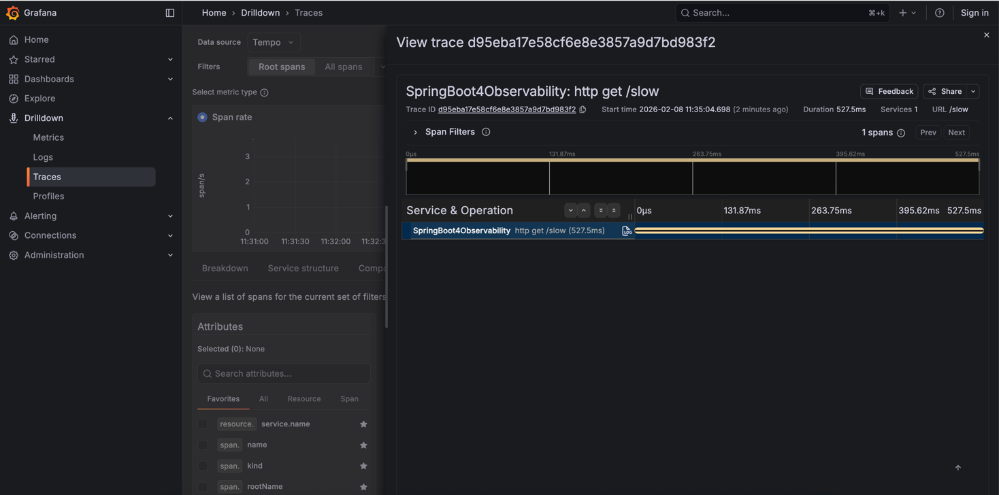
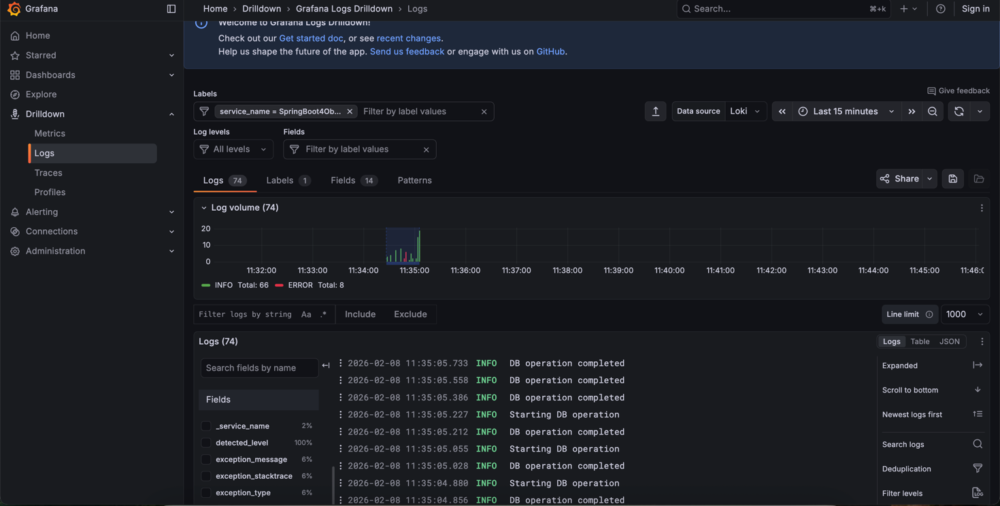

# Spring Boot 4 Observability

This project demonstrates **end-to-end observability** in a **Spring Boot 4** application using:

* **Micrometer**
* **Prometheus** (metrics)
* **Grafana** (visualization)
* **Loki** (logs)
* **Tempo** (distributed tracing)

The setup is compatible with **Virtual Threads** and modern Java (JDK 21+).

---

## 🧱 Tech Stack

| Component       | Purpose                       |
| --------------- | ----------------------------- |
| Spring Boot 4   | Application framework         |
| Micrometer      | Metrics + Tracing abstraction |
| Prometheus      | Metrics backend               |
| Grafana         | Dashboards & visualization    |
| Loki            | Centralized logging           |
| Tempo           | Distributed tracing           |
| Virtual Threads | Scalable concurrency          |

---

## 📁 Project Structure

```
SpringBoot4Observability/
├── src/main/java
│   └── com/dinesh/observability
│       ├── controller
│       │   └── WelcomeController.java
│       ├── filter
│       │   └── TraceIdFilter.java
│       └── SpringBoot4ObservabilityApplication.java
├── docker
│   ├── prometheus.yml
│   └── docker-compose.yml
├── docs
│   └── images
│       ├── grafana-jvm-dashboard.png
│       ├── grafana-http-metrics.png
│       ├── tempo-trace.png
│       ├── loki-logs.png
│       └── trace-id-response.png
└── README.md
```

---

## 🚀 Running the Application

### 1️⃣ Start Observability Stack

```bash
docker compose up -d
```

Services started:

| Service    | URL                                            |
| ---------- | ---------------------------------------------- |
| Grafana    | [http://localhost:3000](http://localhost:3000) |
| Prometheus | [http://localhost:9090](http://localhost:9090) |
| Loki       | [http://localhost:3100](http://localhost:3100) |
| Tempo      | [http://localhost:3200](http://localhost:3200) |

---

### 2️⃣ Start Spring Boot App

```bash
./mvnw spring-boot:run
```

Application runs on:

```
http://localhost:8080
```

---

## 🧪 Sample REST Endpoints

### `WelcomeController`

```java
@RestController
@Slf4j
public class WelcomeController {

    @GetMapping("/welcome")
    public String welcome() {
        log.info("Welcome endpoint called");
        return "Welcome to Spring Boot 4 Observability";
    }

    @GetMapping("/slow")
    public String slowApi() throws InterruptedException {
        log.info("Slow API called");
        Thread.sleep(2000);
        return "Slow response completed";
    }

    @GetMapping("/err")
    public String error() {
        log.error("Error endpoint triggered");
        throw new RuntimeException("Intentional error for observability demo");
    }
}
```

---

## 🔗 Available Endpoints

| Endpoint      | Description             |
|---------------| ----------------------- |
| `/welcome`    | Logs + trace generation |
| `/slow`       | Latency simulation      |
| `/err`        | Error metrics + traces  |
| `/actuator/prometheus` | Prometheus metrics      |
| `/actuator/health` | Health status           |

---

## ▶️ Test with curl

```bash
curl http://localhost:8080/welcome
curl http://localhost:8080/slow
curl http://localhost:8080/err
```

Generate load:

```bash
for i in {1..20}; do curl http://localhost:8080/slow; done
```

---

## 🔍 TraceIdFilter (X-Trace-Id Response Header)

Each HTTP response includes the **current trace ID** for easy correlation.

### Example Response Header

```
X-Trace-Id: 9f1c4d2a3b7e91f4
```

---

### TraceIdFilter Implementation

```java
package com.dinesh.observability.filter;

import io.micrometer.tracing.Tracer;
import jakarta.servlet.Filter;
import jakarta.servlet.FilterChain;
import jakarta.servlet.ServletRequest;
import jakarta.servlet.ServletResponse;
import jakarta.servlet.http.HttpServletResponse;
import lombok.RequiredArgsConstructor;
import org.springframework.stereotype.Component;

@Component
@RequiredArgsConstructor
public class TraceIdFilter implements Filter {

    private static final String TRACE_ID_HEADER = "X-Trace-Id";
    private final Tracer tracer;

    @Override
    public void doFilter(
            ServletRequest request,
            ServletResponse response,
            FilterChain chain)
            throws java.io.IOException, jakarta.servlet.ServletException {

        if (response instanceof HttpServletResponse httpResponse) {
            var span = tracer.currentSpan();
            if (span != null) {
                httpResponse.setHeader(
                        TRACE_ID_HEADER,
                        span.context().traceId()
                );
            }
        }
        chain.doFilter(request, response);
    }
}
```

---

## 🗒️ Logs Correlation

Logs automatically include:

```
traceId
spanId
```

Example:

```
INFO [traceId=9f1c4d2a3b7e91f4 spanId=ab12cd34] Slow API called
```


\
\


---

## 📈 Grafana Dashboards

### JVM & Application Metrics


\
\
\
### HTTP Latency & Error Rate



---

## 🔁 Tempo – Distributed Tracing

Example trace flow:

```
Client
 └── /api/slow
      ├── Controller
      └── Service
```

### Tempo Trace View





\
\


---

## 🗒️ Loki – Logs

Search logs using traceId:

```
{app="spring-boot-4-observability"} |= "traceId"
```


### Loki Logs View
\



---

## 🔗 Observability Correlation Flow

```
Metrics (Prometheus)
   ↓
Traces (Tempo)
   ↓
Logs (Loki)
```

Grafana allows seamless navigation between all three.

---

## 🧠 Key Highlights

* ✔ Virtual-thread safe
* ✔ No ThreadLocal usage
* ✔ Automatic trace propagation
* ✔ Production-ready observability stack
* ✔ Client-visible traceId

---

## 📌 Next Enhancements

* Custom spans
* WebClient / RestClient tracing
* Gateway-level observability
* Load testing (k6 / Gatling)
* Grafana dashboard JSON export

---

## 📜 License

MIT [LICENCE](LICENCE)

---
