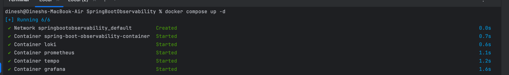
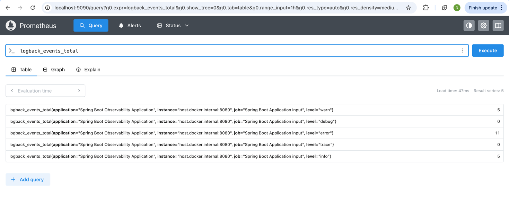
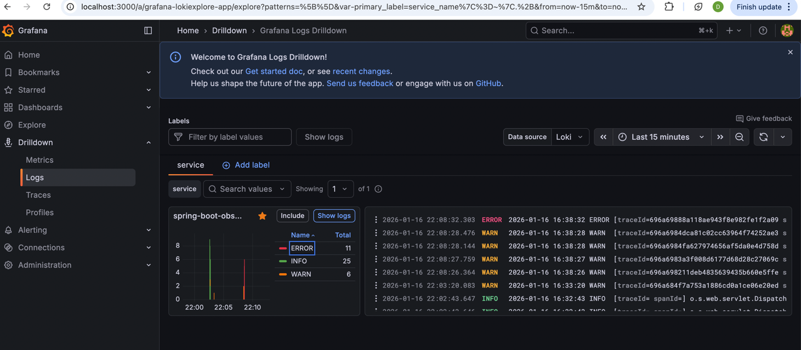
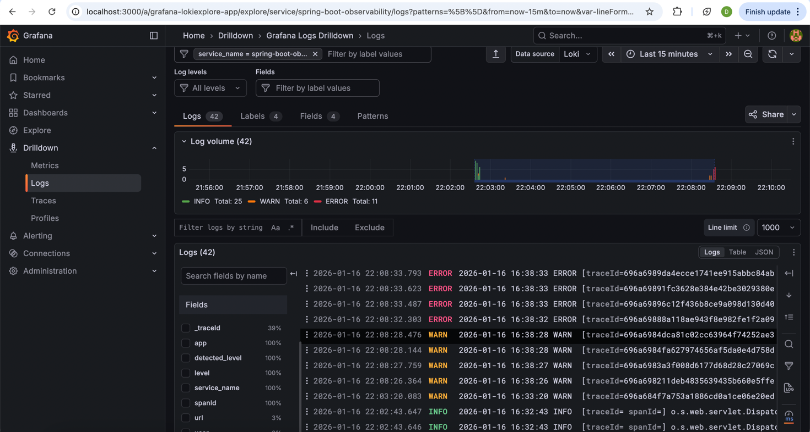
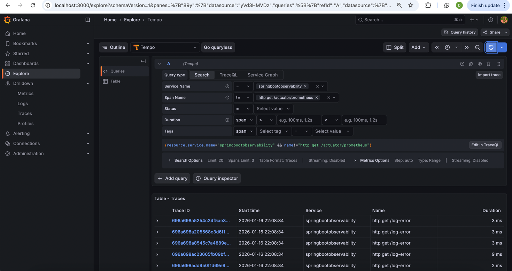
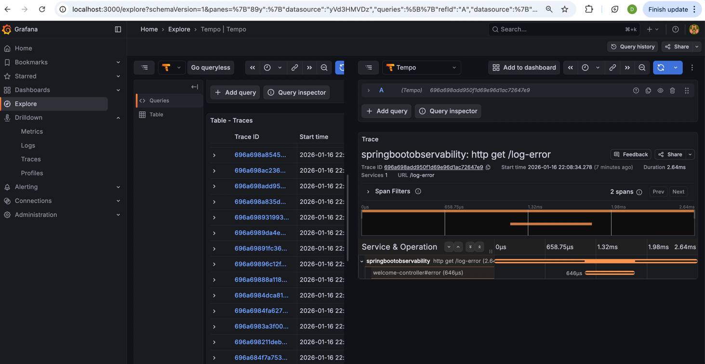
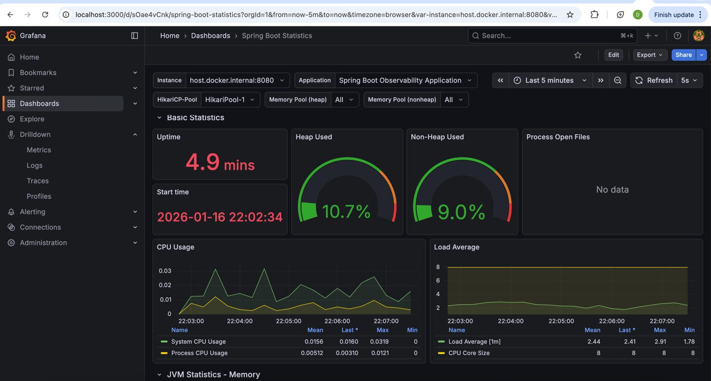

# 🧠 Spring Boot Observability (Spring Boot 3)

A complete **Spring Boot 3 observability example** demonstrating **Metrics, Traces, and Logs** using:

* **Micrometer**
* **Prometheus**
* **Tempo (Tracing)**
* **Loki (Logging)**
* **Grafana (Visualization)**

This project supports both:

* **Running locally (without Docker)**
* **Running fully Dockerized**

---

## 📁 Project Structure

```
SpringBootObservability/
├── src/main/java/
├── src/main/resources/
│   ├── application.properties
│   └── logback-spring.xml
├── data/
│   ├── grafana/
│   │   ├── dashboards/
│   │   └── datasource.yml
│   ├── prometheus/
│   │   └── prometheus.yml
│   ├── loki/
│   │   └── loki-config.yml
│   └── tempo/
│       └── tempo.yml
├── Dockerfile
├── docker-compose.yml
├── pom.xml
└── README.md
```

---

# 🚀 Running WITHOUT Docker (Local Setup)

## 1️⃣ application.properties (Local)

```properties
spring.application.name=spring-boot-observability

# Actuator exposure
management.endpoints.web.exposure.include=*

# Enable tracing
management.tracing.sampling.probability=1.0

# OTLP tracing endpoint (Tempo / Zipkin locally)
management.otlp.tracing.endpoint=http://localhost:4317
```

---

## 2️⃣ Run Application

```bash
mvn spring-boot:run
```

---

## 3️⃣ Available Endpoints

| Endpoint               | Purpose           |
| ---------------------- | ----------------- |
| `/actuator/health`     | Health check      |
| `/actuator/metrics`    | Metrics list      |
| `/actuator/prometheus` | Prometheus scrape |
| `/api/**`              | Generates traces  |

---

# 📊 Metrics – Micrometer + Prometheus

Micrometer automatically collects:

* HTTP request count & latency
* JVM memory & GC
* Thread & CPU metrics

Prometheus scrape endpoint:

```
http://localhost:8080/actuator/prometheus
```

---

# 🔍 Tracing – Micrometer + Tempo

Each request generates:

* Trace ID
* Span ID
* Timing information

Traces are exported using **OTLP**.

---

# 🪵 Logging – Loki

`logback-spring.xml` sends logs to Loki and correlates them with traces.

Example pattern:

```xml
%X{traceId} %X{spanId}
```

This enables **log ↔ trace correlation in Grafana**.

---

# 🐳 Running WITH Docker (Recommended)

## application.properties (Docker)

```properties
spring.application.name=spring-boot-observability

management.endpoints.web.exposure.include=*
management.tracing.sampling.probability=1.0

# Use service name instead of localhost
management.otlp.tracing.endpoint=http://tempo:4317
```

📌 **Key Difference**

* Local → `localhost`
* Docker → service name (`tempo`)

---

## docker-compose.yml (Conceptual Overview)

Services:

* Spring Boot App
* Prometheus
* Loki
* Tempo
* Grafana

All configurations are mounted from the `/data` directory.

To run application just use 
```
docker compose up -d

```
It will fetch all containers and start the application.



---

# 📂 Data Folder – Tool Configurations

## 🔹 Prometheus (`data/prometheus/prometheus.yml`)

```yaml
global:
  scrape_interval: 5s

scrape_configs:
  - job_name: spring-boot
    metrics_path: /actuator/prometheus
    static_configs:
      - targets: ["app:8080"]
```



---

## 🔹 Loki (`data/loki/loki-config.yml`)

```yaml
auth_enabled: false

server:
  http_listen_port: 3100

schema_config:
  configs:
    - from: 2023-01-01
      store: boltdb-shipper
      object_store: filesystem
      schema: v11
      index:
        prefix: index_
        period: 24h

storage_config:
  filesystem:
    directory: /tmp/loki
```





---

## 🔹 Tempo (`data/tempo/tempo.yml`)

```yaml
server:
  http_listen_port: 3200

distributor:
  receivers:
    otlp:
      protocols:
        grpc:
        http:

storage:
  trace:
    backend: local
    local:
      path: /tmp/tempo
```





---

## 🔹 Grafana Datasources (`data/grafana/datasource.yml`)

```yaml
apiVersion: 1

datasources:
  - name: Prometheus
    type: prometheus
    access: proxy
    url: http://prometheus:9090
    isDefault: true

  - name: Loki
    type: loki
    access: proxy
    url: http://loki:3100

  - name: Tempo
    type: tempo
    access: proxy
    url: http://tempo:3200
```

---

# 📈 Grafana Dashboards (Reserved Section)

👉 Users also can add:

* Import JVM dashboards (Preconfigured default  dashboard: SpringBootObservability/data/grafana/dashboards )



* Import Spring Boot dashboards
* View latency, error rates
* Navigate **Metrics → Traces → Logs**


---

# 🧪 Validation Checklist

✔ `/actuator/prometheus` works
✔ Prometheus scraping metrics
✔ Traces visible in Tempo
✔ Logs visible in Loki
✔ Grafana correlates all three

---

# 🤝 Contribution

1. Fork the repository
2. Create a feature branch
3. Add dashboards / improvements
4. Submit a Pull Request

---

# 📜 License

MIT License
See `LICENSE`

---

# 📬 Support

Maintained by **Dinesh Veer**

GitHub: [https://github.com/dinesh-veer](https://github.com/dinesh-veer)


If you find this project useful or plan to use it as a reference:

* ⭐ **Star the repository** to show your support
* 🍴 **Fork the repository** to experiment, customize, and extend it

Starring helps others discover the project, and forking allows you to safely modify and learn without affecting the original codebase.

Thank you for your support! 🙌


---

# 🚀 Future Enhancements

* Alertmanager integration
* Kubernetes manifests
* Auto-provisioned dashboards
* Service maps

---

